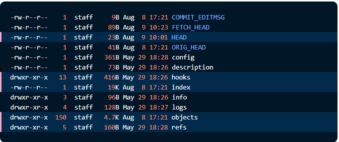
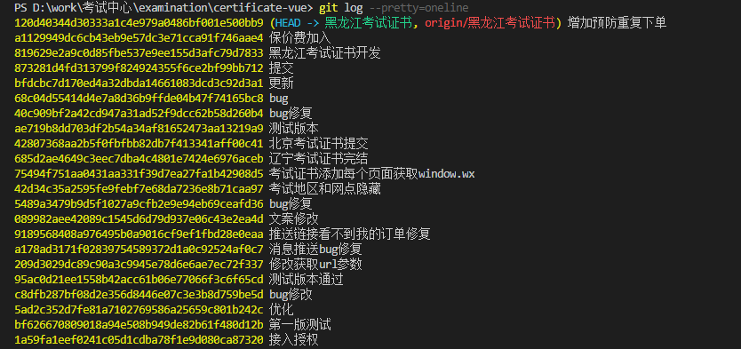
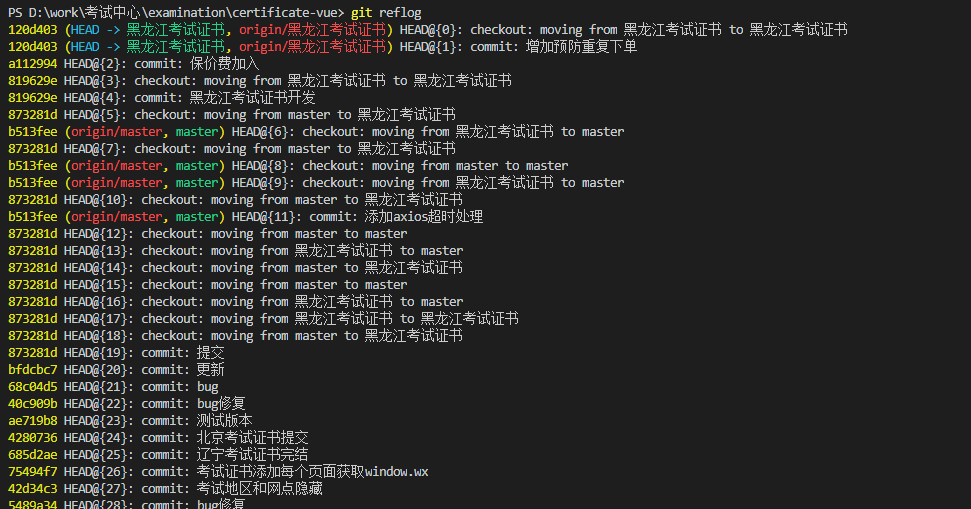
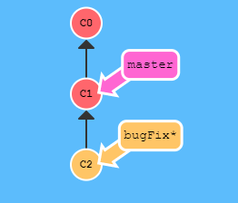
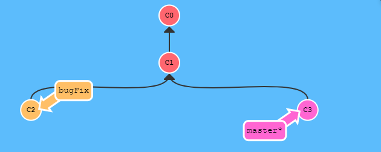
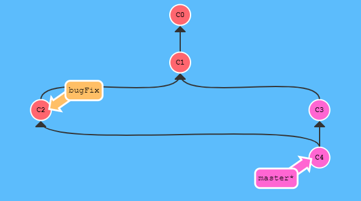
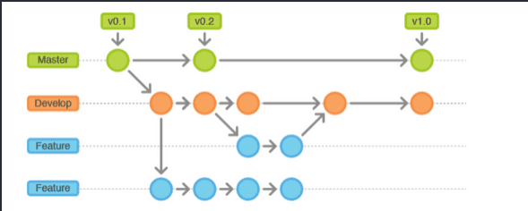
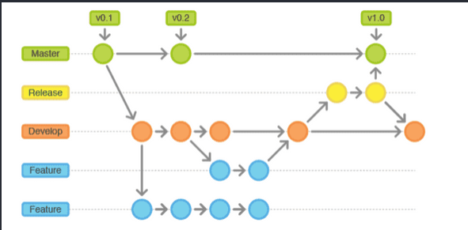

## 什么是 Git？

 <!--more-->

- 被最广泛应用的现代软件管理系统
- github 上成熟且活跃的开源社区
- 分布式架构
- 支持大多数的操作系统和 IDE

### 对分布式架构的理解

- 分布式和集中式，典型代表 Git/SVN
- 集中式，中心化的系统，有一个中心服务器，所有的操作都要基于中心服务器，一旦服务器挂了，或者没网了，开发者就没有办法提交
- 分布式，就是去中心化，每个人都有一个完整的库，就是我们的本地仓库，在离线情况下，仍然可以进行提交
- 虽然我们平时的工作流程是：每个人的本地仓库提交之后推送到远程仓库，远程仓库看起来好像是一个中心，但其实远程仓库也不过是一个用户而已，实际上你也可以 pull 张三的库，push 给李四等等

### git 相关的基本概念

- 工作区（Working Directory/work tree）:就是你的工作目录，就是你在电脑里能看到的目录
- 工作区有一个隐藏目录.git，这个不算工作区，而是 Git 的版本库。Git 的版本库里存了很多东西，其中最重要的就是称为 stage（或者叫 index）的暂存区，还有 Git 为我们自动创建的第一个分支 master，以及指向 master 的一个指针叫 HEAD。
- 暂存区（stage）/索引（index）：里面放的是修改过的文件，简而言之就是 git add 操作之后的文件就会放进来。
- 本地仓库（简称：本地）：输入命令：git commit 此次修改的描述，此次改动就放到了本地仓库，每个 commit，我们叫他为一个版本。
- 远程仓库（简称：远程）输入命令 git push 远程仓库,此次改动就放到了远程仓库(Github 等)。

下面就是.git 的目录


- index 就是暂存区，是 Git 中的重要概念，当对工作区修改、新增文件执行 git add 命令之后，就会产生一个新纪录存入暂存区中。
- HEAD 是一个游标，当我们创建版本库的时候，git 会主动为我们创建一个分支 master。此时 HEAD 指向 master 最近的一个提交，如果你切换到 dev 分支了，那么 HEAD 指向的就是 dev 分支最近的一个提交。
- 针对某些危险操作，Git 通过记录 HEAD 这真的上次所在的位置 ORIG_HEAD 提供了回退的功能。当你发现某些操作失误了，比如错误的的 reset 到了一个很早很早的版本，可以使用 git reset --hard ORIG_HEAD 回退到上一次 reset 之前。
- hooks：顾名思义，钩子。里面存放了多钟钩子文件，都是.sample 后缀，是示例文件，不生效的。去掉.sample 后缀才生效，比如 pre-commit.sample 文件，这个钩子在执行 git commit 之前调用，我们在项目中使用的 husky+lint-staged 就是改了这个钩子文件来实现提交前的校验。
- COMMIT_EDITMSG 存放了你最近一个提交的提交信息。
- refs 保存了各个本地分支和远程分支以及 tags 当前所指向的提交，HEAD 和 refs 的关系： HEAD -> refs/heads/branchName -> commit。heads,remote,tags 这三个文件夹是一定存在，存放各个分支和 tags 指向的提交，保存的都是提交的 sha1。stash 是当你执行了 git stash 暂存之后生成的一个文件，将当前最前面的 stash 记录生成一个 sha1 写进这里面。
- objects 存放了所有的 git 对象，有兴趣了解更多关于 Objects 的东西，可以点[这里](https://zhaohuabing.com/post/2019-01-21-git/)

### git 配置

在 git 中，我们使用 git config 命令来配置 git 的配置文件，git 配置级别主要有以下 3 类：

- 仓库级别 local 【优先级最高】
- 用户级别 global【优先级次之】
- 系统级别 system【优先级最低】

通常，git 仓库级别对应的配置文件是当前仓库下的.git/config

用户信息：

```
git config --global user.name "John Doe"

git config --global user.email johndoe@example.com

```

如果使用了 --global 选项，那么该命令只需要运行一次，因为之后无论你在该系统上做任何事情， Git 都会使用那些信息。 当你想针对特定项目使用不同的用户名称与邮件地址时，可以在那个项目目录下运行没有 --global 选项的命令来配置。

检查配置信息：
如果想要检查你的配置，可以使用 git config --list 命令来列出所有 Git 当时能找到的配置：

```
$ git config --list
user.name=John Doe
user.email=johndoe@example.com
color.status=auto
color.branch=auto
color.interactive=auto
color.diff=auto
...
```

你可以通过输入 git config <key>： 来检查 Git 的某一项配置:

```
git config user.name
John Doe
```

## git 常用命令

`git init`, `git clone`, `git add`, `git commit`,`git pull`,`git push`,`git status`

`git merge`, `git rebase`, `git reset`, `git revert`, `git cherry-pick`

### **git init**

生成有个 git 版本库，在当前目录下生成一个隐藏文件.git

### **git clone**

创建一个本地仓库的克隆版本（克隆某个远程仓库到本地）

```
git clone path/to/reposit
```

从远端服务器上克隆一个版本库

```
git clone username@host:/path/to/repository
```

git 主要使用协议、本地协议、http 协议、git 协议、ssh 协议。http 协议是最方便的，git 协议是最快的。

### **git add**

Add file contents to the index.将指定文件添加到暂存区

```
git add path/to/file
```

批量添加文件

```
// .表示当前目录，这个命令代表将当前目录下所有工作区的改动添加到暂存中
git add .

// -A表示--all添加工作区下所有的改动，不仅仅是当前目录下。
git add -A
```

### **git commit**

将所有暂存区的内容生成一个 commit 提交记录保存到本地版本库中。每次使用 git commit 命令我们都会在本地版本库生成一个 40 位的哈希值，这个哈希值也叫 commit-id,commit-id 在版本回退的时候是非常有用的，它相当于一个快照，可以在未来的任何时候通过与 git reset 的组合命令回到这里。

```
// 这种是比较常见的用法，-m参数表示可以直接输入后面的"message",如果不加-m参数，那么是不能直接输入message的，而是会调用一个编辑器一般是vim编辑器让你来输入这个message。
git commit -m "commit message"

// 其他功能如-m参数，加的-a参数可以将所有已跟踪的文件中的执行修改或删除操作的文件都提交到本地仓库，即使他们没有经过git add添加到暂存区。新加的文件（即没有被git系统管理的文件）是不能被提交到本地仓库的。建议一般不要使用-a参数，正常的提交还是使用git add先将要改动的文件添加到暂存区，再用git commit 提交到本地版本库。
git commit -a -m "message"

// 修改最近一次提交的提交信息（也叫追加提交，他可以在不增加一个心得commit-id的情况下将新修改的代码追加到前一次的commit-id中）
git commit --amend

// 查看帮助
git commit --help

```

##### 在 git 中，任何已提交的东西几乎都是可以恢复的，但是那些未提交丢失之后就无法恢复了。

### ** git log**

在提交了若干更新之后，又或者克隆了某个项目，想回顾下提交历史，可以使用 git log 命令查看。

```
// --pretty选项，可以指定使用完全不同于默认格式的方式展示提交历史。比如用`online`将每个提交放在一行显示。另外还有`short`,`full`,`fuller`可以用
$ git log --pretty=oneline
ca82a6dff817ec66f44342007202690a93763949 changed the version number
085bb3bcb608e1e8451d4b2432f8ecbe6306e7e7 removed unnecessary test code
a11bef06a3f659402fe7563abf99ad00de2209e6 first commit

// 但最有意思的是 format，可以定制要显示的记录格式，这样的输出便于后期编程提取分析，像这样：
$ git log --pretty=format:"%h - %an, %ar : %s"
ca82a6d - Scott Chacon, 11 months ago : changed the version number
085bb3b - Scott Chacon, 11 months ago : removed unnecessary test code
a11bef0 - Scott Chacon, 11 months ago : first commit
```

更多关于`git log`的使用可以看[这里](https://git-scm.com/book/zh/v1/Git-%E5%9F%BA%E7%A1%80-%E6%9F%A5%E7%9C%8B%E6%8F%90%E4%BA%A4%E5%8E%86%E5%8F%B2)

### **git-reflog**

可以用来恢复本地错误操作很重要的一个命令。

git log 和 git reflog 的区别：git log 命令可以显示所有提交过的版本信息，如图所示：

git reflog 可以查看所有分支的所有操作记录（包括已经被删除的 commit 记录和 reset 的操作。有 commit 记录，checkout 记录）如图：


### **git remote**

远程仓库：托管在因特网或其他网络中的你的项目的版本库。你的项目可以只有一个远程仓库，也可以有多个远程仓库。

```
// 查看远程仓库。选项 -v，会显示需要读写远程仓库使用的 Git 保存的简写与其对应的 URL。 如果你的远程仓库不止一个，该命令会将它们全部列出
git remote -v

// 添加远程库
git remote add <shortname> <url>

// 删除远程仓库
git remote rm name
```

### ** git pull **

- Fetch from and integrate with another repository or a local branch，从另一个仓库或者本地分支获取并与之集成。 git pull 其实是一个简写，是 git fetch 和 git merge FETCH_HEAD 这两个命令的简写。

```
git pull [<options>] [<repository> [<refspec>…​]]

```

`<repository>`是仓库的名字，`<refspec>` 是分支的名字。如果都不写，会有一个默认值。

例子：

```
 A---B---C master on origin
	      /
D---E---F---G master
	      ^
    origin/master in your repository
```

远程的 master 分支到了 c,本地的开发到了 G。

```
	        A---B---C origin/master
	       /         \
D---E---F---G---H master
```

git pull 之后会生成一个新的 H,合并两个分支。

如果发生了冲突，可以使用 git reset --merge 进行回退。

#### options(选项)

```
// 允许无关的历史，这个选项，更多是在更改远程仓库的时候用到。
–allow-unrelated-histories

// When the merge resolves as a fast-forward, only update the branch pointer, without creating a merge commit. This is the default behavior.
-ff

// Create a merge commit even when the merge resolves as a fast-forward. This is the default behaviour when merging an annotated (and possibly signed) tag that is not ///// stored in its natural place in refs/tags/ hierarchy.
–no-ff

// Refuse to merge and exit with a non-zero status unless the current HEAD is already up to date or the merge can be resolved as a fast-forward.
–ff-only
```

ff 选项，这几个选项是说合并时是否开启 fast-forward，快速合并。

常用的 git pull 命令：

```
git pull origin dev:dev
git pull <远程主机名> <远程分支名>:<本地分支名>

// 这条命令是下面这两条命令的简写
git fetch origin
git merge orign/dev

// 本地分支可以省略, pull的默认行为就是merge到你当前所在的分支
git pull origin dev

// 当前dev分支与origin/dev分支建立了追踪关系，所以远程分支名也可以省略
git pull origin

// 当前版本库只存在一个fetch url，远程名也可以省略
git pull

```

git pull --rebase 使用 git rebase 来代替 git merge，至于为什么，我们后面会讲到。

```
git pull --rebase origin dev

// 这条命令等同于执行下面两条命令

git fetch origin
git rebase orgin/dev
```

### **git fetch**

```
git fetch <远程主机名> //这个命令将某个远程主机的更新全部取回本地

git fetch <远程主机名> <分支名> //只想取回特定分支的更新
```

取回更新后，会返回一个 FETCH_HEAD ，指的是某个 branch 在服务器上的最新状态，我们可以在本地通过它查看刚取回的更新信息：

```
git log -p FETCH_HEAD
```

#### git pull 和 git fetch 的区别

git fetch 是将远程主机的最新内容拉到本地，用户在检查了以后决定是否合并到工作本机分支中。

而 git pull 则是将远程主机的最新内容拉下来后直接合并，即：git pull = git fetch + git merge，这样可能会产生冲突，需要手动解决。

### **git push**

Updates remote refs using local refs,将本地提交推送到远程仓库

- 完整使用

```
git push [<repository> [<refspec>...]]
```

git push <远程主机名> <本地分支名> <远程分支名>

- 其他

```
// -u是--set-upstream的简写，表示origin/master分支和local/master分支建立追踪关系，此后使用git push就是采用这种默/// 认方式推送到origin/master分支上
git push -u origin master

// 省略了远程分支名，表示将本地分支推送到与之存在追踪关系的远程分支，通常是一个同名的分支，如果远程没有该分支就会被创/// 建
git push origin master

// 删除origin/dev分支
git push origin :dev

// 这个也是删除origin/dev分支
git push origin -d dev

// 在多人协作开发下，如果其中一个小伙伴删除了远程的某个分支，但是没有主动告诉其他伙伴他删除了分支，所以其他伙伴就可以使用这个命令来手动检查更新远程分支的情况
git remote prune origin

// 这条命令也是检查远程分支的情况
git fetch --prune
```

### **git status**

查看工作区的状态，这个命令可以看作是一种智能提示，因为这个命令不仅会显示 working tree 当前状态，同时还会提示你下一步的操作。

### **git merge**

- `git merge`是通过合并其他分支的 histories 来达到当前分支往前走的目的
- `git merge`有`fast-forward`和`no-fast-forward`两种默认方式进行合并，git 会根据不同的情况采取不同的默认方式进行合并。

例一：这种情况下 master 分支相对于 dev 分支，只是简单的落后于 dev 分支，在 dev 分支前进的时间里，master 分支没有产生其他的 mommit，此时执行`git merge dev`是采用`fast-forward`，直接快进，不会产生一个新的 commit 节点。


快速合并的结果：


例二：此时在 master 分支相对于 dev 分支，不仅仅是简单的落后于 dev 分支，在 dev 分支前进的同时 master 分支也在前进，此时执行 git merge dev 就会产生一个新的 commit 节点来记录这一次的 merge。


合并后产生一条新的 commit


值得注意的是，在 fast-forword 默认模式下，你可以使用—no-ff(no fast forward)来阻止快速合并，强制生成一条合并 commit 记录此次合并，但是在 no-fast-forward 默认模式下，不能强制更改为 fast-forward 合并。只能使用别的当时去合并，这便是下面要说的，rebase,变基。

### **git rebase**

第二种合并分支的方法是`git rebase`。Rebase 实际上就是取出一些列的提交记录，“复制”他们，然后在另外一个地方逐个的放下去。也就是改变当前分支的初始 commit，然后在新的 base 上一个个地运行这个分支上所有的 commits。

Rebase 的优势就是可以创造更线性的提交历史。如果只允许使用 Rebase 的话，代码库的提交历史将会变得异常清晰。


例一： 像上面这种情况：可能因为你的同事在 master 上改了 bug，或者开发了新的功能上传到了 master，你开发的功能依赖你同事开发的部分，所以这时候你需要合并代码。如果此时使用 merge 的话，一定会产生一条 merge 树，这样非常丑，所以你可以是使用这样的操作：

```
git checkout bugFix
git rebase master

```


#### 那到底什么时候用 git merge，什么时候用 git rebase 呢？

- 使用 merge 合并分支，希望在 git 中留下当前 local 分支存在过的记录，即使以后那个分支删除了，还是能在 git 提交记录中找到那个分支开始和结束时间。
- 使用 rebase 整理分支，是不希望当前的 local 分支出现在提交树中，他并不具备有特殊的意义，自然也不需要留下痕迹，更不应该把提交树的提交搞得混乱不堪。

#### rebase 黄金定律

```
永远不要rebase一个远程已经存在的分支（比如，rebase到master、develop、release分支上），只能rebase自己使用的私有的分支。

```

- 当前 local 分支存在具有特殊意义，比如说是需要展现一个功能开发过程的 feature 分支，或者是体现一个 bug 修复过程的 bugFix 分支，这些分支都应该体现在提交树中，因为它能完整的体现一段业务实现的过程，所以这些情况下，应该使用`git merge localBranchName --no-ff` .使用`--no-ff`来确保一定会生成一个`merge commit`，因为如果你要合并的分支在 localBranch 之后没有更改，那么 git 在 merge 的时候会采用`fast-forward`模式，这种模式下合并的时候不会产生一个`merge commit`，这样就达不到目的了，所以必须加上`--no-ff`这个参数去确保`merge commit`的产生。

- `local branch`的存在仅仅是为了开发的同时保持 master 分支（这里举例为 master，实际上可能是其他你将要合并的分支）的稳定，不存在其他特殊的意义，那么此时就应该用`git rebase+merge`来达到`fast-forward`合并。具体操作如下：

```
// 如果此时master分支从local branch创建之后没有新的提交，那可以直接merge
git checkout master
git merge localBranchName
// 如果master分支从local branch创建之后有产生了新的提交，那么local branch 需要先使用rebase来确保merge的时候采用fast-forward模式
git rebase master
git checkout master
git merge localBranchName
// 这里为什么不直接在master分支上rebase，因为master分支上的提交已经在中央仓库中已经存在了，rebase会重写历史记录，这对于已经push完成的记录是不合理的。这样做也不符合之前说的rebase黄金定律
```

- 在使用`git pull`命令的时候，应该使用`git pull --rebase`来代替。pull 命令是 fetch 和 merge 两条命令的合并，使用`--rebase`是使用`git rebase`来代替`git merge`。例如，在 dev 分支，你 commit 了一些提交，这时候你的同时在 dev 分支上 push 了一些 commit，这是经常出现的场景，此时如果你直接 push 的话 git 会禁止你的 push 操作，它会提示你先 pull 在进行 push 操作。所以这时候需要执行`git pull`。那么和普通的 mmerge 操作一样，当 origin/dev 和你本地的 dev 分支进行 merge 的时候肯定会产生一条 merge commit，并且留下一条不必要的树在 git 记录中。但是这条 merge 记录是毫无意义的，甚至是多余的，只会让提交树变得很乱的感觉。而使用 rebase 的话，将会重写整个 histories，不会残留不必要的记录，污染历史图谱，而且这个过程并不会和之前我们说的 rebase 黄金定律相矛盾。

#### rebase 的其他作用

有这么一种场景：

```
我们在开发一个功能的过程中，可能有很多不必要的提交，可是我们想要一些比较完整的、直观的提交，所以我们想要整理commit
因为如果不整理，直接push到远程的话，会导致一个混乱的History，长期如此，hostory tree将会混乱不堪。
```

这时候，在 push commit 之前，先使用 rebase 来将我们本地分支的 commit 记录整理一下。

```
// -i/--interactive 列出将要生成新的提交的commit lists
// 474ac4f9612a1c830f41ab6d8514ca38381a066f是最后一个需要被整理的commit前一个commit的sha1
git rebase -i 474ac4f9612a1c830f41ab6d8514ca38381a066f
// 后面不带commit sha1的话表示将当前index中所有commit列举出来
git rebase -i

```

执行完这个命令之后，会出现一个提交页面：这是一个可编辑的界面，在这个界面你可以修改 commit 提交信息，整合 commit 等等。值得注意的是这里的 commit 排序是倒叙，最下面那个 commit 才是最后一条提交；如果要使用 squash 将提交整合，squash 的 commit 前面必须保留至少一个 commit。

### ** git reset**

- `git reset`将 HEAD 重置到某个特定的状态；
- `git reset`主要使用的有 soft,mixed,hard 三个模式，这三个模式区别之处在于影响的范围不一样。

```
// 索引和工作区都不会被改变
git reset --sort commit/HEAD~4(表示当前HEAD前4个commit)
// 索引改变，工作区回到暂存之前的状态，这种也是git的默认方式
git reset --mixed commit/HEAD~4
// 索引和工作区都会回到给定提交的状态，新增的文件会被删除，被删除的文件还原
git reset --hard commit/HEAD~4
```

当你想要回到哪个状态，就用`git reset --hard 想要回到的那个sha1`

- `git reset`是相对危险的命令，尤其是 hard 模式，当然这些更新都将只是针对`local branch`。如果这些还原要同步到 origin， 在没有改动到 origin commit 的前提下，直接 push，但是在 reset 了 origin commit 的情况下，需要使用`git push -f(--force)`来执行推送。 `git reset --hard`和 g`it push -f`是极其危险的操作，一旦重置，原来的记录就找不回，所以不推荐在开发过程中使用。

### ** git revert**

使用 git revert 撤销某次操作，这次操作之前的和之后的 commit 和 history 都会保留，并且将这次的撤销作为一次最新的提交。执行 revert 命令时要求工作树必须是干净的。

- `git revert commit`
- `git reset`是让 HEAD 往后退，它改写了 history, `git revert`是让 HEAD 往前走，生成一个新的 commit 来记录这一次的反转，相对而言，reset 更加危险。

适用场景： 如果我们想撤销之前的某一版本，但是又想保留该目标版本后面的版本，记录下这整个版本变动流程，就可以用这种方法

### ** git cherry-pick**

如果你想将一些提交复制到当前所在的位置（HEAD）下面的话， Cherry-pick 是最直接的方式了.从其他分支的挑选出你需要的 commits， 移植到当前分支，产生一个新的 commit 来进行提交.

```
// 将你需要的commit的sha1写在命令后面，这样你所选择的那些commit就会出现在当前的分支上.
git cherry-pick [commidSha1, [commidSha1...]]
// 你也可以选择一个commit区间，它的范围就是 startCommidSha1 到 endCommidSha1 之间所有的commit，但是它这是一个 (左开，右闭] 的区间，也就是说，它将不会包含 startCommidSha1 的 commit。
git cherry_pick <startCommidSha1>…<endCommidSha1>
// 如果想要包含 startCommidSha1 的话，就需要使用 ^ 标记一下，就会变成一个 [左闭，右闭] 的区间
git cherry-pick <startCommidSha1>^...<endCommidSha1>

```

### ** git stash**

常用 git stash 命令：

（1）git stash save "save message" : 执行存储时，添加备注，方便查找，只有 git stash 也要可以的，但查找时不方便识别。

（2）git stash list ：查看 stash 了哪些存储

（3）git stash show ：显示做了哪些改动，默认 show 第一个存储,如果要显示其他存贮，后面加 stash@{\$num}，比如第二个 git stash show stash@{1}

（4）git stash show -p : 显示第一个存储的改动，如果想显示其他存存储，命令：git stash show stash@{\$num} -p ，比如第二个：git stash show stash@{1} -p

（5）git stash apply :应用某个存储,但不会把存储从存储列表中删除，默认使用第一个存储,即 stash@{0}，如果要使用其他个，git stash apply stash@{\$num} ， 比如第二个：git stash apply stash@{1}

（6）git stash pop ：命令恢复之前缓存的工作目录，将缓存堆栈中的对应 stash 删除，并将对应修改应用到当前的工作目录下,默认为第一个 stash,即 stash@{0}，如果要应用并删除其他 stash，命令：git stash pop stash@{\$num} ，比如应用并删除第二个：git stash pop stash@{1}

（7）git stash drop stash@{$num} ：丢弃stash@{$num}存储，从列表中删除这个存储

（8）git stash clear ：删除所有缓存的 stash

#### 没有在 git 版本控制中的文件，是不能被 git stash 存起来的.如果没有被版本控制的文件想要被 stash 起来，可以使用`git add`将他加入到版本控制里面，再 stash。

### ** git checkout**

常用命令：

```
$ git checkout <branchname> # → 切换分支到branchname

$ git checkout -b <branchname> # → 等同于执行上两步，即创建新的分支并切换到该分支

$ git checkout -- xx/xx # → 回滚单个文件

```

### **git diff**

git diff --staged 或 git diff --cached 可查看已暂存文件和上次提交的区别
git diff 可以查看你当前工作目录和上次提交与本地索引间的差异

### ** git -打标签**

Git 可以给历史中的某一个提交打上标签，以示重要.

- Git 使用两种主要类型的标签：轻量标签(lightweight)与附注标签(annptated)。
- 一个轻量标签很像一个不会改变的分支--它只是一个特定提交的引用。
- 然而附注标签是存储在 Git 数据库中的一个完整对象。他们是可以被校验的；其中包含打标签者的名字、电子邮件地址、日期时间；还有一个标签信息；并且可以使用 GNU Privacy Guard （GPG）签名与验证.通常建议创建附注标签，这样你可以拥有以上所有信息；但是如果你只是想用一个临时的标签，或者因为某些原因不想要保存那些信息，轻量标签也是可用的。

常见的标签的使用命令：

```
// 列出标签
git tag

// 创建附注标签
git tag -a v1.4 -m "my version 1.4"

// 使用 git show 命令可以看到标签信息与对应的提交信息
git show v1.4
tag v1.4
Tagger: Ben Straub <ben@straub.cc>
Date:   Sat May 3 20:19:12 2014 -0700

my version 1.4

commit ca82a6dff817ec66f44342007202690a93763949
Author: Scott Chacon <schacon@gee-mail.com>
Date:   Mon Mar 17 21:52:11 2008 -0700

    changed the version number

// 创建轻量标签，创建轻量标签，不需要使用 -a、-s 或 -m 选项，只需要提供标签名字。
git tag v1.4-1w

// 如果在标签上运行 git show，你不会看到额外的标签信息。 命令只会显示出提交信息
git show v1.4-1w
commit ca82a6dff817ec66f44342007202690a93763949
Author: Scott Chacon <schacon@gee-mail.com>
Date:   Mon Mar 17 21:52:11 2008 -0700

    changed the version number

```

#### 后期打标签

你也可以对过去的提交打标签。 假设提交历史是这样的：

```
$ git log --pretty=oneline
15027957951b64cf874c3557a0f3547bd83b3ff6 Merge branch 'experiment'
a6b4c97498bd301d84096da251c98a07c7723e65 beginning write support
0d52aaab4479697da7686c15f77a3d64d9165190 one more thing
6d52a271eda8725415634dd79daabbc4d9b6008e Merge branch 'experiment'
0b7434d86859cc7b8c3d5e1dddfed66ff742fcbc added a commit function
4682c3261057305bdd616e23b64b0857d832627b added a todo file
166ae0c4d3f420721acbb115cc33848dfcc2121a started write support
9fceb02d0ae598e95dc970b74767f19372d61af8 updated rakefile
964f16d36dfccde844893cac5b347e7b3d44abbc commit the todo
8a5cbc430f1a9c3d00faaeffd07798508422908a updated readme
```

现在，假设在 v1.2 时你忘记给项目打标签，也就是在 “updated rakefile” 提交。 你可以在之后补上标签。 要在那个提交上打标签，你需要在命令的末尾指定提交的校验和（或部分校验和）：

```
$ git tag -a v1.2 9fceb02
```

可以看到你已经在那次提交上打上标签了:

```
$ git tag
v0.1
v1.2
v1.3
v1.4
v1.4-lw
v1.5

$ git show v1.2
tag v1.2
Tagger: Scott Chacon <schacon@gee-mail.com>
Date:   Mon Feb 9 15:32:16 2009 -0800

version 1.2
commit 9fceb02d0ae598e95dc970b74767f19372d61af8
Author: Magnus Chacon <mchacon@gee-mail.com>
Date:   Sun Apr 27 20:43:35 2008 -0700

    updated rakefile
...
```

更多关于标签的用法，请点[这里](https://git-scm.com/book/zh/v2/Git-%E5%9F%BA%E7%A1%80-%E6%89%93%E6%A0%87%E7%AD%BE)

### **集中式工作流**

- 这个是参考 SVN 产生的一个工作模型，线上只维护一个分支，就是主分支 master，所有的开发者都基于这个分支进行 commit、push
- 这种模式的好处就是，完全照搬了 SVN 工作模式，SVN 用户不需要额外学习 git 就能上手。但是这完全没有使用 git 分布式协作的优点，所以这种方式极少采用。

### **功能分支工作流**

- master-feature 模型，这个模型在集中式的基础上给每个新功能开发建立一个专门的分支。这样既隔离了多个开发者的功能开发，不会弄乱代码，又保证了开发期间 master 分支的稳定性，但同时这种方式也具有足够的灵活性。
- 功能开发隔离让 pull request 工作流成为可能，每个功能完成要合并到 master 前都需要提交 pullnrequest，团队伙伴 review 后再选择是否 merge
- feature 分支是否推送到中央仓库都可以，由于 master 是仅有的一个[特殊]分支，在中央仓库存在多个功能分支不会有任何问题

### ** Gitflow 工作流**

- Gitflow 工作流是管理功能开发、发布准备和维护的常用模式。相对于其他两种模型，Gitflow 相对复杂和繁琐，但是对于大型复杂项目，这种模式往往是最合理的。
- Gitflow 模型是 master-develop-release， master 仍然作为主分支，develop 作为开发分支，release 承担着预发布的责任。这种模型下，master 和 dev 都是需要长期维护的分支，release、hotfix、featrue 这三种分支都是短期分支，发布结束，bug 修复结束，功能开发结束便会删除。

#### 功能开发

功能开发过程类似功能分支工作流模型，每一个新功能都用一个新的 featrue 分支开发，但是不同的是，featrue 不是从 master 上创建的，而是从 dev 分支上创建。feature 从来不会和 master 分支交互。功能分支上的功能开发完成之后合并到 dev 分支\


#### 发布测试

- 一旦 dev 分支上拥有了一次发布所需要的所有功能，就从 dev 分支上创建一个 release 发布分支，来完成之后的发布流程。这个 release 不会再合并新的功能，它只做 bug 修复，文档生成以及其他面向发布任务的事情。直到测试完成，发布工作全部完成之后，打好 tag， 合并到 master 分支，完成上线。
- 完成发布之后，release 分支自创建依赖产生了一些 commit，需要合并回 dev 分支。
- 这个发布分支的存在让发布流程和其他新功能开发流程可以同时进行，相互不受影响。
  

#### 维护分支

- 维护分支，hotfix 分支就是上线之后用于上线后给产品快速打补丁，hotfix 也是唯一从 master 主分支创建出来的分支,它测试完成之后需要合并到 master 和 dev 分支， master 分支上要打好 tag 重新发布。
  

#### 参考资料

[git](http://cristo.top/git/)
