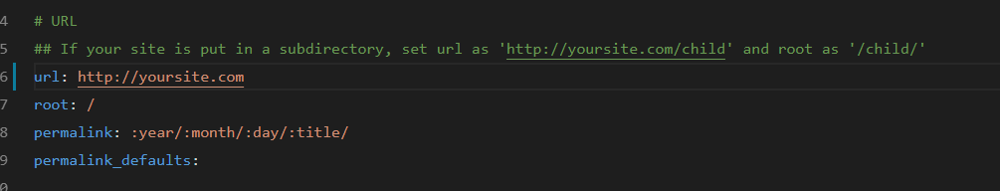
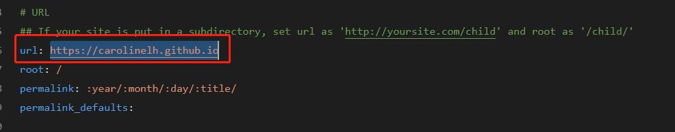

## 背景
我发现我的文章的图片都出不来
## 解决
* 首先需要配置_config.yml里面的post_asset_folder:false这个选项设置为true
* 安装[hexo-asset-image](https://github.com/7ym0n/hexo-asset-image)这个插件。安装了这个插件之后，在使用命令hexo new "xxx"来生成md博文时，/source/_posts文件夹内除了xxxx.md文件还有一个同名的文件夹，可以把图片放入该文件夹。
* 使用markdown语法直接插入图片即可。

正常来说，这样就可以解决问题了，但是我发现图片仍然出不来。我看了下图片的路径:``,说明问题出在找不到我的文章所在域名。于是我找到了文章所对应的那个index.html，发现index.html中的所有的图片的域名就是//yoursite.com，于是我怀疑是我的配置有问题。。。。

最终我发现是在根目录下的_config.yml中：

没有配置我的网站的域名！！！！！！

最后我重新配置

解决问题！！

