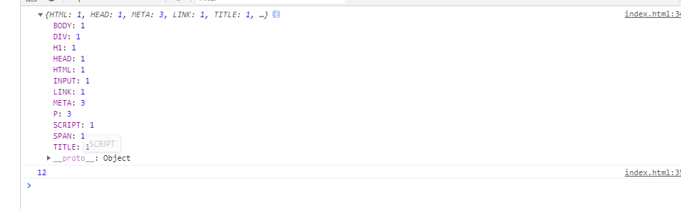
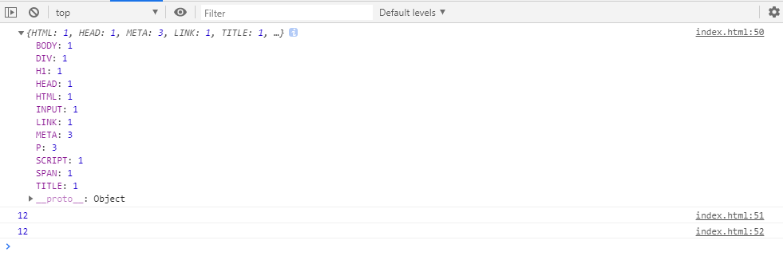

## 背景
昨晚听了大圣老师的公开课，对于他提的这个问题，感觉自己不是很熟悉，所以就来认真的整理一下。
 <!--more-->
 ## 解题
 #### 涉及知识：js基础
我们的所有解题代码如下：
```js
<!DOCTYPE html>
<html lang="en">

<head>
  <meta charset="UTF-8">
  <meta name="viewport" content="width=device-width, initial-scale=1.0">
  <meta http-equiv="X-UA-Compatible" content="ie=edge">
  <link rel="stylesheet" href="">
  <title>页面中有多少种标签以及标签的个数</title>
</head>

<body>
  <h1>测试啊</h1>
  <div>
    <span>1111</span>
    <p></p>
    <p></p>
    <p></p>
    <input type="text">
  </div>
  <script>
    // ES6
    let allTags = Array.from(document.querySelectorAll('*')).map(v => v.tagName)
    let kinds = new Set(allTags).size

    let newObj = {}
    for(let i of allTags) {
      if (!newObj[i]) {
        newObj[i] = 1
      } else {
        newObj[i]++
      }
    }
    console.log(newObj)


    // JS
    let allTags = document.querySelectorAll('*')
    let newTags = []
    allTags.forEach(ele => newTags.push(ele.tagName))
    let newObj = {}
    newTags.forEach(element => {
      if(!newObj[element]) {
        newObj[element] = 1
      } else {
        newObj[element]++
      }
    })
    console.log(newObj)
    console.log(Reflect.ownKeys(newObj).length)
    console.log(Object.keys(newObj).length)
  </script>
</body>

</html>
```

#### 方法一：ES6
```js
let allTags = Array.from(document.querySelectorAll('*')).map(v => v.tagName)
    let kinds = new Set(allTags).size

    let newObj = {}
    for(let i of allTags) {
      if (!newObj[i]) {
        newObj[i] = 1
      } else {
        newObj[i]++
      }
    }
    console.log(newObj)
    console.log(kinds)

```
执行结果如下：

##### 知识点：Array.from用法、map()用法、Set用法

###### 1. Array.from
[MDN地址](https://developer.mozilla.org/zh-CN/docs/Web/JavaScript/Reference/Global_Objects/Array/from)
Array.from() 方法从一个类似数组或可迭代对象创建一个新的，浅拷贝的数组实例。简单理解就是把可迭代对象转化成数组。

Array.from() 方法有一个可选参数 mapFn，让你可以在最后生成的数组上再执行一次 map 方法后再返回。也就是说 Array.from(obj, mapFn, thisArg) 就相当于 Array.from(obj).map(mapFn, thisArg)

###### 2.Set
set对象允许存储任何类型的唯一值,无论是原始值或者是对象引用。set对象是值的集合,元素只会出现一次,即Set中的元素是唯一的.

new Set([iterable])  返回一个新的Set对象


#### 方法二：JS
```js
let allTags = document.querySelectorAll('*')
    let newTags = []
    allTags.forEach(ele => newTags.push(ele.tagName))
    let newObj = {}
    newTags.forEach(element => {
      if(!newObj[element]) {
        newObj[element] = 1
      } else {
        newObj[element]++
      }
    })
    console.log(newObj)
    console.log(Reflect.ownKeys(newObj).length)
    console.log(Object.keys(newObj).length)
```
执行结果如下：

##### 涉及知识点：forEach()用法、Reflect.ownKeys()和Object.keys()

###### Reflect.ownKeys()和Object.keys()区别
Object.keys()返回属性key，但不包括不可枚举的属性
Reflect.ownKeys()返回所有属性key


